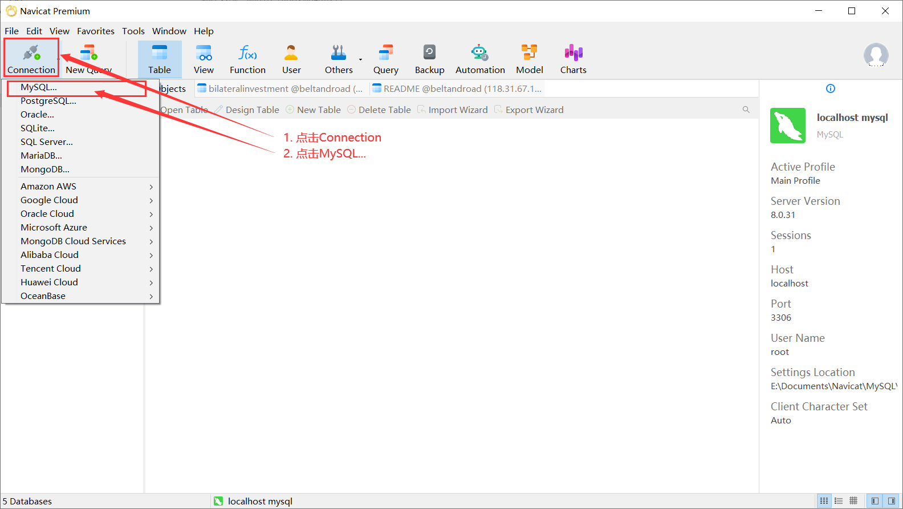
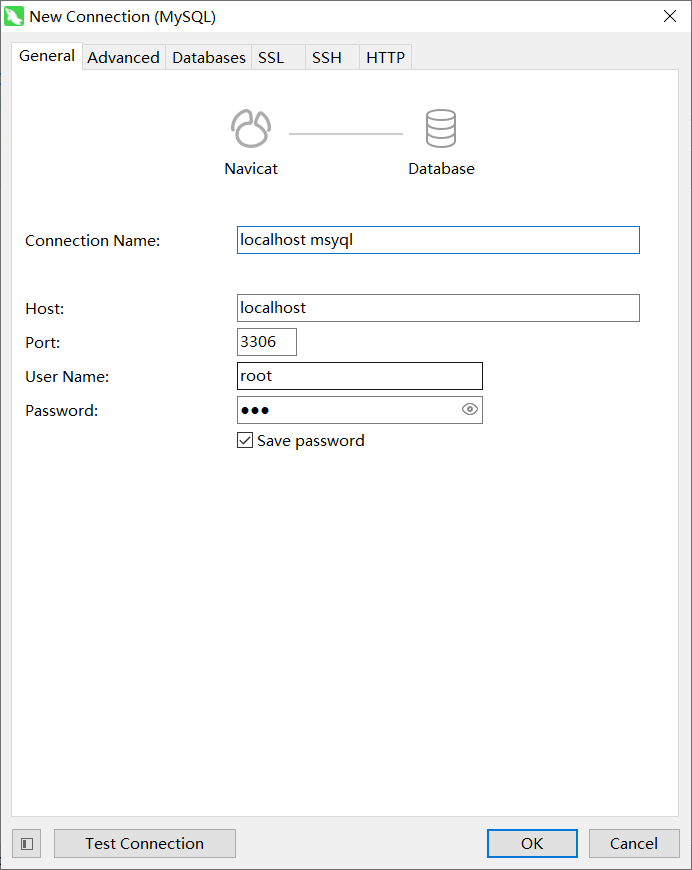
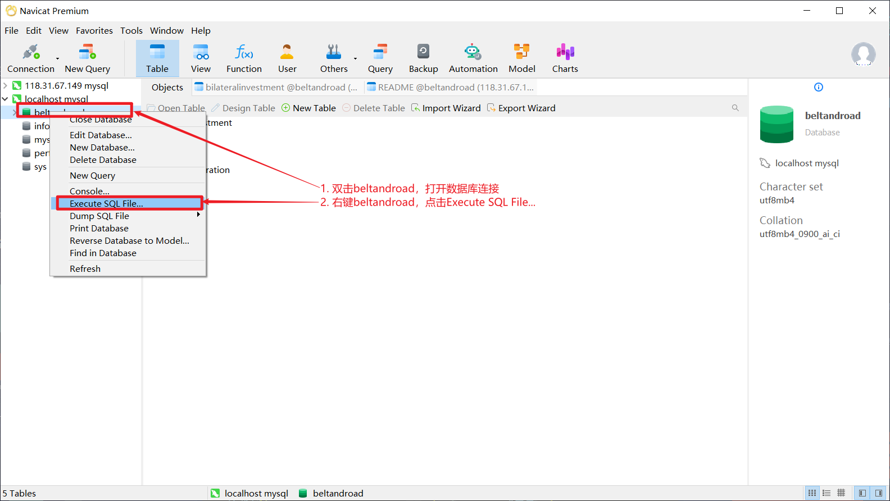
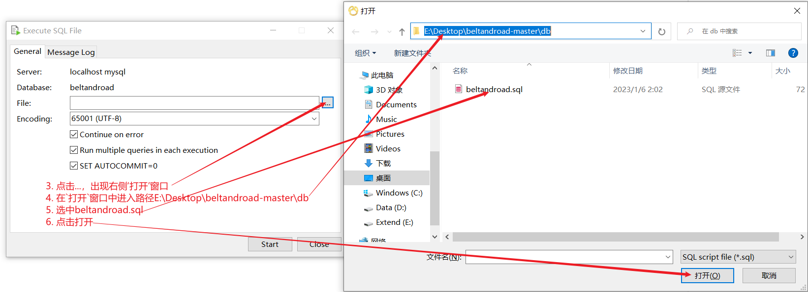
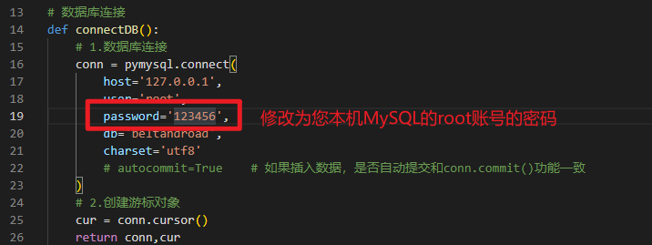
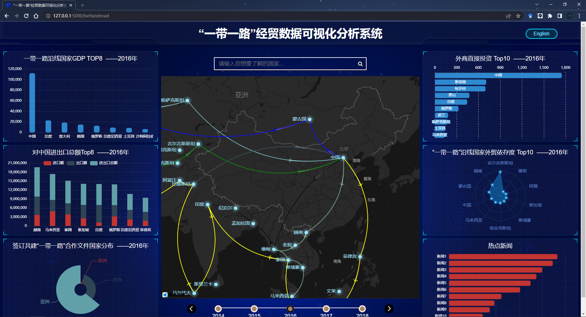

# 前言

本教程用于在本地重现《“一带一路”经贸数据可视化分析系统》。

项目演示视频：[https://www.bilibili.com/video/BV1fd4y1k7oT](https://www.bilibili.com/video/BV1fd4y1k7oT)

本项目基于教程[https://www.bilibili.com/video/BV1v7411R7mp](https://www.bilibili.com/video/BV1v7411R7mp)

源码开源：[https://gitee.com/huangheng179/beltandroad](https://gitee.com/huangheng179/beltandroad)

希望感兴趣的小伙伴可以基于本项目开发出更有趣、更有用、更优秀的项目。如果有什么问题，可以在B站上私信我，也可以QQ联系，QQ：1796915552，加QQ时请注明“《“一带一路”经贸数据可视化分析系统》”。

# 项目目录说明

经典flask项目的目录结构

本项目在经典flask目录结构的基础上添加了些


本项目的目录结构的具体说明


# 项目重现教程

## 技术栈

- echarts.js
- html/css/javascript
- python-flask
- pymysql
- mysql

## 环境说明

操作系统：win10（linux应该也行）

mysql服务端：mysql 8.0.31

mysql客户端：Navicat 16

Python 3.11.0

## 重现步骤

0. 自行准备上述环境，并且将源码拉取到路径`E:\Desktop\beltandroad-master`下

1. 搭建数据库
2. 安装python依赖包
3. 运行与访问

### 搭建数据库

使用Navicat 16连接上本地数据库；



按照下图配置，建立连接，密码为您本机mysql的密码；



双击`localhost mysql`打开连接，右键`localhost mysql`连接，新建数据库，取名为beltandroad

双击`beltandroad`打开数据库，向beltandroad数据库中注入数据





修改文件`E:\Desktop\beltandroad-master\getDataFromDB.py`的19行，将密码改为您的数据库root账号的密码。



### 安装python依赖包

检查是否已安装虚拟环境库`virtualenv --version`，若没有安装，需要安装虚拟环境库`pip install virtualenv`；

进入到项目根目录`cd E:\Desktop\beltandroad-master`；

创建虚拟环境`virtualenv venv`，并运行命令`E:\Desktop\beltandroad-master\venv\Scripts\activate`激活虚拟环境；

运行命令`pip install -r requirements.txt`即可完成python依赖包的安装。

依赖包如下：

```python
click==8.1.3
colorama==0.4.6
Flask==2.2.2
itsdangerous==2.1.2
Jinja2==3.1.2
MarkupSafe==2.1.1
PyMySQL==1.0.2
Werkzeug==2.2.2
```

### 运行与访问

进入到项目根目录`cd E:\Desktop\beltandroad-master`；

运行命令`python app.py`；

打开浏览器，访问 [http://127.0.0.1:5000](http://127.0.0.1:5000)




